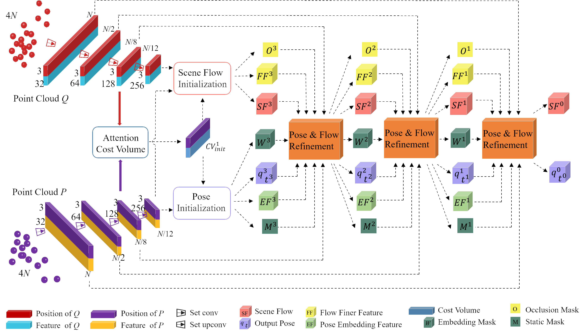
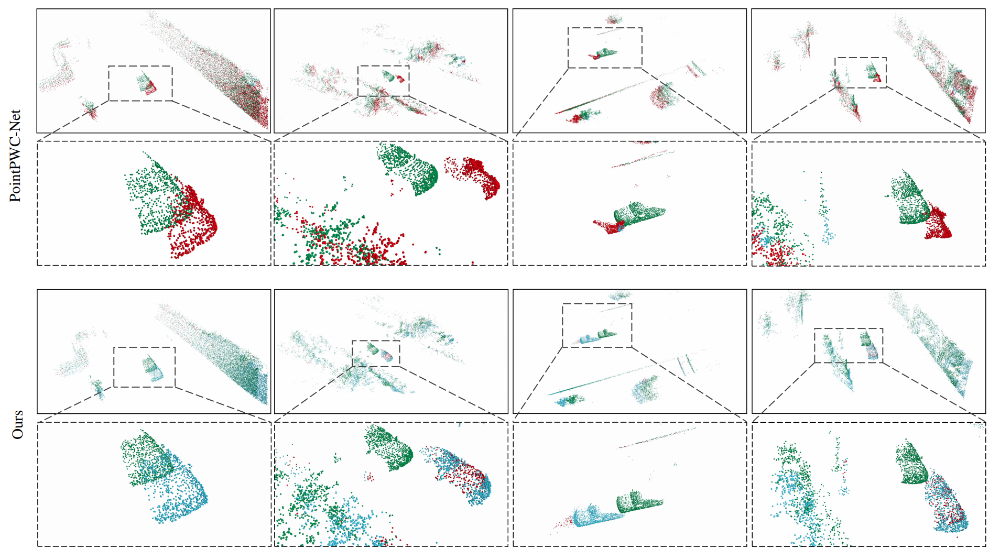

# Unsupervised Learning of 3D Scene Flow with LiDAR Odometry Assistance

<p align="center">
    <!-- paper badges -->
    <a href="https://arxiv.org/abs/2209.049452">
        
    </a>
</p>

<p align="center">
  
</p>

## Environment setup 
Tested with Pytorch 1.10.0 and CUDA 11.3
1. ```bash
   conda create -n psf python=3.8 -y
   conda activate psf
   pip install torch==1.10.2+cu113 torchvision==0.11.3+cu113 torchaudio==0.10.2 -f https://download.pytorch.org/whl/torch_stable.html
   pip install setuptools==58.2.0
   pip install pandas addict tqdm scipy pytz
   ```
   
2. Install pointnet2

   Compile the furthest point sampling, grouping and gathering operation for PyTorch. We use operations from this [repo](https://github.com/sshaoshuai/Pointnet2.PyTorch).
   ```bash
   cd pointnet2
   python setup.py install
   ```
## Train
Set `dataset_path` in the configuration file to the path of the dataset. Then run the following command to train the model.
```bash
python train.py --config config/cfg_psf_train.py
```

## Evaluation
Set `resume_from` in the configuration file to the path of the dataset. Then run the following command to evaluate the model.
```bash
python eval.py --config config/cfg_psf_eval.py
```

## Result
<p align="center">
  
   <center>Visualization of scene flow estimation results on the K-SF dataset for our method and baseline method PointPWC-Net.</center>
</p>


## Citation
If you find our work useful in your research, please cite:
```
@article{wang2022unsupervised,
  title={Unsupervised learning of 3D scene flow with 3D odometry assistance},
  author={Wang, Guangming and Feng, Zhiheng and Jiang, Chaokang and Wang, Hesheng},
  journal={arXiv preprint arXiv:2209.04945},
  year={2022}
}
```

## Acknowledgements
We thank the following open-source projects for the help of the implementations.
+ [PointNet++](https://github.com/charlesq34/pointnet2)

+ [PointPWC-Net](https://github.com/DylanWusee/PointPWC)

We also provided the links to the baseline methods used in our paper as follows: 
+ [ICP](https://github.com/ClayFlannigan/icp)
+ [FGR](https://github.com/isl-org/FastGlobalRegistration)
+ [CPD](https://github.com/gadomski/cpd)
+ [Ego-motion](https://github.com/ivantishchenko/Self-Supervised_Non-Rigid_Flow_and_Ego-Motion)
+ [PointPWC-Net](https://github.com/DylanWusee/PointPWC)
+ [JGwF](https://github.com/HimangiM/Just-Go-with-the-Flow-Self-Supervised-Scene-Flow-Estimation)
+ [SFGAN](https://github.com/IRMVLab/SFGAN)
+ [FLOT](https://github.com/valeoai/FLOT)
+ [Jin et al.](https://github.com/leolyj/DCA-SRSFE)
+ [SPFlowNet](https://github.com/supersyq/SPFlowNet)